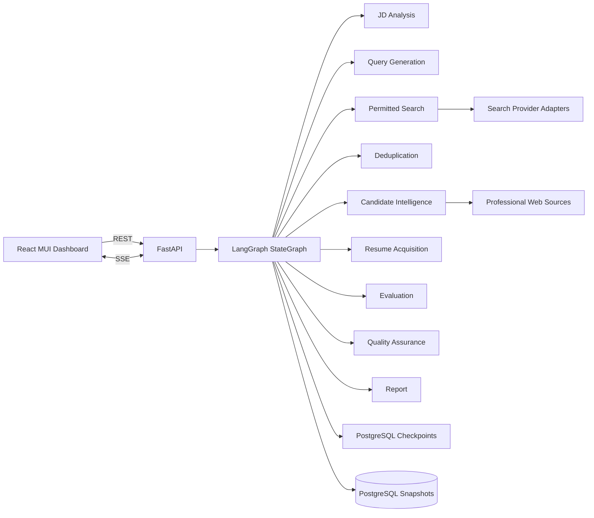

# Architecture

```mermaid
flowchart LR
  R[React MUI Dashboard] -->|REST| A[FastAPI]
  R <-->|SSE| A
  A --> G[LangGraph StateGraph]
  G --> JD[JD Analysis]
  G --> QS[Query Generation]
  G --> S[Permitted Search]
  G --> D[Deduplication]
  G --> C[Candidate Intelligence]
  G --> CV[Resume Acquisition]
  G --> E[Evaluation]
  G --> Q[Quality Assurance]
  G --> RP[Report]
  G --> CP[PostgreSQL Checkpoints]
  G --> DB[(PostgreSQL Snapshots)]
  S --> P[Search Provider Adapters]
  C --> W[Professional Web Sources]
```
